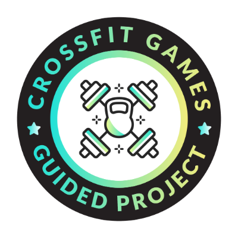
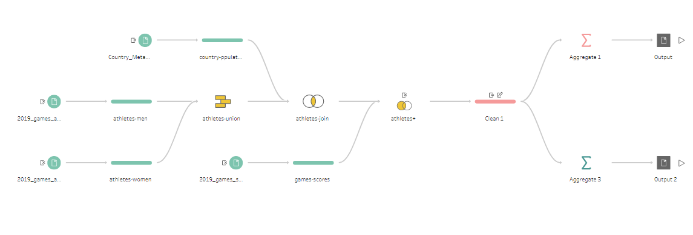

# CrossFit Competitors Data Analysis

*This badge was awarded upon successful completion of the CrossFit Competitors Data Analysis project, showcasing the proficiency in data cleaning, transformation, and visualization.*

This guided project analyzes data on CrossFit competitors to understand their demographics, performance, and country representation. The data has been profiled, cleaned, transformed, and summarized to create meaningful insights for further analysis. The final dashboard visualizes key findings, trends, and metrics.

## Objective 1: Profile & QA the Data

**Tasks**:
1. **Connect to the Data**: The data is sourced from three Excel workbooks and a CSV file.
2. **Data Cleaning**:
   - Remove empty rows from the input files.
   - Identify and standardize field names from each file.
   - Remove the duplicative `rank` field from the `2019_games_scores` file.
3. **Data Exploration**: Analyze the dataset to answer questions like:
   - Which country do most athletes come from?
   - What’s the age range of CrossFit competitors?

## Objective 2: Transform the Data

**Tasks**:
1. **Combine Data**: 
   - Union the `2019_games_athletes_men` and `2019_games_athletes_women` tables into a single view.
2. **Join Tables**:
   - Join the combined athletes table with the `Country_Metadata` table on the country field, keeping only matching records.
   - Join the `2019_games_scores` table with the combined athletes table, ensuring all score records are kept, regardless of whether a match exists.
3. **Data Cleanup**:
   - Remove the `competitor_id` field from the combined athletes table to clean up unnecessary data.

## Objective 3: Clean and Summarize the Data

**Tasks**:
1. **Create New Fields**:
   - Calculate **height** (in inches) and **weight** (in pounds) for each athlete.
   - Create a new field to calculate the number of minutes from the existing time field.
2. **Data Aggregation**:
   - Aggregate the average weight (lbs), average height (ft), average age, and count of competitors by division. Output the result as a local CSV file.
   - Aggregate the average points (lbs) and count of competitors by country of origin. Output the result as a local XLSX file.

## Project Workflow in Tableau Prep

## Files and Project Structure

The project folders/files are organized as follows:
- **files**: Contains the raw data files (Excel and CSV).
- **img**: Contains the project completion badge and screenshots of the dashboard and key insights.
- **Flow-CrossFit.ftl**: Contains the cleaned and aggregated data workflow format.

## Insights

This project provided insights into the distribution of CrossFit competitors across countries, their physical attributes (height and weight), and performance metrics. It highlighted trends in athlete demographics and performance by division and country.

---

