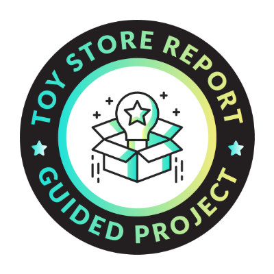

# Maven Toys Sales Analysis Project

## Project Overview
This project focuses on analyzing sales data for Maven Toys. By connecting and profiling data from multiple sources, creating a relational data model, and adding calculated measures, we aim to gain insights into sales performance, revenue, and profitability. The final objective is to visualize the results in an interactive Power BI dashboard.

## Objectives and Tasks

### Objective 1: Connect and Profile the Data
- **Goal**: Connect to the source data files and perform initial data profiling.
- **Tasks**:
  - Connect to `sales.csv`, `products.csv`, `stores.csv`, and `calendar.csv`.
  - Review columns for blanks or null values, check datatypes, and identify primary and foreign keys.
  - Profile data to answer questions, such as:
    - How many transactions are recorded?
    - How many stores does Maven Toys operate?
    - What are the lowest and highest-priced products?
  - Add calculated columns in the calendar table for `start of month` and `start of week`.

### Objective 2: Create a Relational Model
- **Goal**: Design a star schema by defining relationships between fact and dimension tables.
- **Tasks**:
  - Load tables into the data model, linking `sales` with `products`, `stores`, and `calendar`.
  - Implement a date hierarchy using `start of month`, `start of week`, and `date` fields.
  - Hide foreign keys in the sales table to streamline report views.

### Objective 3: Add Calculated Measures & Fields
- **Goal**: Enhance the data model with calculated fields and measures for meaningful analysis.
- **Tasks**:
  - Calculate `revenue` and `profit` per transaction using fields from the `products` table.
  - Create measures for `total orders`, `total revenue`, and `total profit`.
  - **Bonus**: Define revenue and profit measures without referencing calculated columns in `sales`.

### Objective 4: Build an Interactive Report
- **Goal**: Visualize data with interactive charts and KPIs in a Power BI report.
- **Tasks**:
  - Create KPI visuals for `total orders`, `total revenue`, and `total profit` (current month and trends).
  - Add a slicer to filter by store location.
  - Visualize `total orders` by product category (bar chart) and `total revenue` over time (line chart).
  - Arrange charts and visuals into a cohesive layout and finalize formatting.

